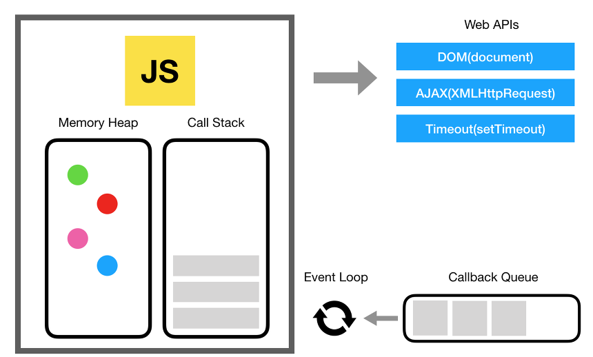

Javascript는 기본적으로 싱글 스레드(Single Threaded) 구조로써, 한 번의 요청을 수행하는 동안, 다른 요청을 처리할 수 없다. 하지만 우리는 비동기 함수를 사용하면서 마치 동시에 여러 스레드가 수행되는 것처럼 병렬 로직을 작성하기도 했다.(`Promise.all`)

결론부터 말하자면, 자바스크립트 자체만으로는 병렬 처리를 할 수 없다. **비동기 함수 또한 사실, 직렬로 처리된다. 단지 적절한 시간에 지연되어 실행될 뿐이다.**
   
비동기 함수가 어떻게 처리 되는지는 자바스크립트 런타임 환경의 이벤트 루프의 작동 원리를 통해 이해할 수 있다.

# 자바스크립트의 실행 구조와 자바스크립트 런타임 모델의 작동 원리
   


위의 그림을 보면 다음을 알 수 있다.
- Javascript 엔진 자체만으로는 크게 메모리 힙과 콜 스택의 자료 구조를 가지고 있다.
- Javascript를 실행하는 런타임 모델은 콜백 큐라는 자료구조를 가지고, 이벤트 루프를 통해 제어되고 있다.
- 위의 그림에서 Web APIs는 클라이언트 사이드 Web APIs(DOM, AJAX ...)로 브라우저에서 자바스크립트가 호출할 수 있는 대부분의 비동기 함수를 포함한다. 

> 위의 그림을 브라우저 환경이 아닌 Node.js 환경으로 대체한다면, Web APIs 대신 비동기적으로 동작하는 Node.js 내장 모듈로 대체할 수 있다,(fs, dns...)

자바스크립트가 실행될 수 있는, 자바스크립트 엔진부터 살펴보자.

## 함수는 콜스택의 최상단에 올라야 비로소 실행된다.

다음과 같은 자바스크립트 로직이 있다고 해보자.
```js
function A() {
  B();
  return 0;
}
A();
```
해당 함수가 실행되는 순서를 메모리 구조 관점에서 보면 다음과 같다.

> 1. `A` 함수가 실행될 때, `Frame`의 단위로 콜 스택에 올라간다. `Frame`은 해당 함수가 호출될 떄의 파라미터, 함수 내부의 지역변수를 포함하여 생성된다. 이를 `FrameA` 라고 하자.
> 2. 함수 내부에 또 다른 함수`B`가 있다면, 콜스택에 쌓여있던 `FrameA` 위에 해당 함수의 프레임인 `FrameB`가 쌓인다.
> 3. `B`가 수행을 완료하면, `FrameB`는 콜 스택의 밖으로 꺼내지게 된다.
> 4. 이후 다시, `FrameA`가 최상단에서 실행되면서, 최종적으로 `0`을 반환하게 된다.

하지만, 이것만으론 비동기 함수를 설명할 수 없다. 만약 **한 함수가 콜 스택의 최상단을 차지하는 시간이 너무 길다면, 싱글 스레드인 자바스크립트로써는 다른 모든 작업을 멈춰야만 한다**.

이러한 자바스크립트의 한계를 런타임(브라우저, Node.js) 차원에서 도와주는 방법이, **콜백 큐와 이벤트 루프**이다.

## 콜백 큐는 콜백 함수(비동기 함수)가 콜스택에 올라가기 전에 대기하는 장소이다.
 
상대적으로 처리 시간이 오래 걸리는 I/O 작업이나, `setTimeout`와 같은 비동기 함수를 호출했을 때, 해당 함수가 적절한 시간에 실행될 수 있도록 대기하는 콜백 큐에 들어가게 된다.

```js
function A() {
  setTimeout(() => console.log('콜백 큐에 들어갈 콜백 함수'), 1000);
}
A();
```
콜백 함수가 콜백 큐에 들어갈 때, `Message`라는 콜백 함수를 처리하는 객체의 형태로 큐에 들어가게 된다. **이벤트 루프는 콜백 큐와 콜 스택을 감시하며, 콜 스택이 비었을 때, 가장 오래된 메시지를 큐에서 꺼내 메세지와 연결된 함수를 호출하여 콜 스택 프레임을 생성**한다.
   
각 메세지는 다른 메세지에 영향을 주지 않으며, 반드시 한 메시지가 끝나야 다음 메시지가 실행된다(Run-to-Completion)

# 자바스크립트 직렬 처리의 성능을 끌어올리는 방법

위의 사실로, 자바스크립트 자체만으론 비동기 함수, 동기 함수 모두 지연 시간의 차이일 뿐, 결국 하나의 콜스택에서 직렬 방식으로 처리된다는 것을 알 수 있다.

결국, 자바스크립트 하나의 언어로 모든 것을 감당하기에는 성능 문제가 너무 크다는 것이다.

하지만, 자바스크립트의 실행은 자바스크립트가 실행되는 런타임을 빼놓고 이야기할 수 없다. 그만큼 런타임 측에서 자바스크립트를 보조하는 것이 많다.

자바스크립트의 한계, 즉 싱글 스레드만으로는 해결할 수 없는 것들은 예를 들어 다음과 같다.

- 클라이언트 사이드(브라우저)의 Web APIs
    - DOM Control
    - AJAX
    - Timer(`setTimeout`... )
    - ...
- 서버 사이드(Node.js)의 libuv에서 지원하는 비동기 기능
    - 파일 시스템 접근 모듈(fs)
    - DNS
    - ...


## C, Rust와 같은 로우 레벨 API를 활용한 성능 향상

> 이하 글의 `외부 시스템`은, 즉 자바스크립트로 실행되는 환경이 아닌 다른 멀티 쓰레드를 지원하는 언어로 만들어진 환경을 뜻한다. 실제로 브라우저의 Web APIs는 C++, Rust로 이루어진 기능을 자바스크립트로 호출할 수 있게 추상화해둔 것이다. - [MDN Web APIS](https://developer.mozilla.org/en-US/docs/Learn/JavaScript/Client-side_web_APIs/Introduction)

외부 시스템에 접근해 어떠한 기능 혹은 자원을 호출할 때의 단점은 언제 해당 요청 결과가 자바스크립트 환경으로 들어올지 보장할 수 없다는 것이다.


# 참고글
- [MDN - Event Loop](https://developer.mozilla.org/ko/docs/Web/JavaScript/Event_loop)
- [Blocking/Non-Blocking, Sync/Async](https://joooing.tistory.com/entry/%EB%8F%99%EA%B8%B0%EB%B9%84%EB%8F%99%EA%B8%B0-%EB%B8%94%EB%A1%9C%ED%82%B9%EB%85%BC%EB%B8%94%EB%A1%9C%ED%82%B9)
- [NodeJS 는 Single Thread 일까? Multi Thread 일까?](https://haeunyah.tistory.com/81)