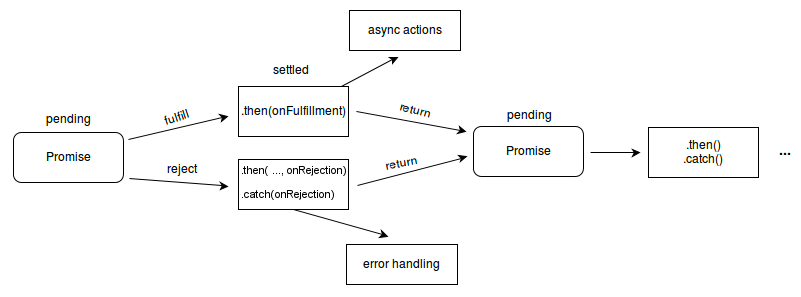

API 호출, Data Access, File I/O 등, 자바스크립트에서는 비동기 함수를 다룰 일이 많다. 특히 기존 레거시 코드에서 `Promise`를 사용하다가 새로 들어온 개발자가 `async/await`와 혼용하여 사용하는 경우도 흔하지 않게 볼 수 있다.
   
프로젝트 개발 전, `EsLint`과 같은 코딩 컨벤션 툴로 이를 강제할 수는 있겠지만, 만약 이에 대한 명확한 정의 없이 개발에 들어가면, 다음과 같은 코드를 작성하는게 문제가 되지 않는다.

- 비밀번호를 초기화하는 데이터 접근 함수
> 일부 공개할 수 없는 부분은 제외했다.
 ```js

const InitPassword = (user_id, hashed_password) => {
    return new Promise(async (resolve, reject) => {
        try {
            const sql = '<UPDATE QUERY>'
            
            const bind = [user_id, hashed_password];
          
            const result = await DBClient(sql, bind);
            
            if (result.affectedRows == 0)
                reject({
                    success: false,
                    message: '비밀번호 초기화 에러'
                });
            else resolve();
        } catch (error) {
            reject({
                success: false,
                message: '비밀번호 초기화 에러'
            });
        }
    });
};
```
위와 같은 코드는 문제 없이 동작한다. 가끔은 문제 없이 동작하는게 문제가 될 수 있다.
   
위의 코드의 문제점은 무엇인지 알아보기 전에 javascript에서 비동기 함수를 다루는 세 가지 방법을 왜 쓰는지 살펴보자.


# `CallBack`에서 `Promise`, `Promise`에서 `async`/`await`
자바스크립트에서 비동기 함수를 다루는 세 가지 방법의 목적은 다음과 같다.
> 난 순서가 보장되지 않는 비동기 함수를 동기 함수처럼 순서를 보장하고 싶어
비동기 함수는 병렬 처리로 시스템 자원을 효율적으로 쓸 수 있다는 장점이 있지만, 비동기 함수 요청의 결과의 순서를 보장할 수 없다는 단점이 있다. 이러한 문제를 해결하기 위해 처음 등장한 것이 `CallBack`이다.

## `CallBack`
가장 초창기의 비동기를 다루는 방식이다.
   
그 유명한 Callback Hell(콜백 지옥)의 원인은 다음과 같이 **콜백 함수 실행 시 다음에 실행할 함수를 매개변수로 넘겨야한다**는 것이다.

```js
callback1((value) => {
  callback2((value) => {
    callback3((value) => {
      callback4((value) => {
        //...
      })
    })
  })
})
```
n번째 콜백 함수 내부에서 n+1번째 콜백 함수를 실행하므로써, 비동기 함수를 순차적으로 실행시킬 수는 있었지만, **가독성이 현저히 떨어진다**.

또한, 비동기 함수를 실행할 때의 성공, 실패 여부를 `try~catch` 방식이 아닌, 매개변수를 통해 `error`를 넘겨주는 방식으로 처리해야 한다.

- PDF를 추출하는 레거시 라이브러리를 사용할 때(`pdftotext`), 예외 처리
```js
const extractPDF = (pdf_upload_path, callback) => {
  pdftotext.pdfToText(pdf_upload_path, {}, (err, data) => {
    // 추출 실패 시
    if (err) {
      return callback(err)
    }
    // 추출 성공 시
    callback(null, data)
  })
}

extractPDF(pdf_upload_path, (err,  data) => {
  if(err) { // 비동기 함수가 실패했을 경우
    console.log(err.message);
    return;
  }
  
  console.log(data); // 비동기 함수가 성공적으로 결과를 반환할 경우
})

```
위와 같은 문제점으로 인해, 현재는 거의 사용되지 않는 방식이지만, `Callback`으로 작성된 라이브러리를 사용할 때, 필요할 수 있으므로 반드시 알아둬야할 개념이다.

## `Promise`

`Callback` 방식의 문제점을 해결하기 위해 `Promise`가 등장했다. `Promise`는 비동기 함수를 다음과 같이 세 가지 상태로 구분한다.

- Pending: 대기 상태(이행하지도, 거부하지도 않은 상태)
- Fulfilled: 이행 상태(연산에 성공함)
- Rejected:  실패 상태(연산에 실패함)



비동기 함수가 성공적으로 처리되었을 때, 중간에 모종의 이유로 실패했을 때의 예외 처리를 `then`과 `catch`를 통헤 `Callback` 방식 보다 명시적으로 처리할 수 있다


- PDF 추출 로직을 Promise로 변경
```js
const extractPDf = (pdf_upload_path) => {
  return new Promise((resolve, reject) =>  {
    pdftotext.pdfToText(pdf_upload_path, {}, (err, data) => {
      //추출 실패 시
      if(err) {
        return reject(err) // Pending 상태의 Promise를 실패 상태(Rejected) 상태로 전환
      }
      
      //추출 성공 시
      resolve(data) // Pending 상태의 Promise를 이행 상태(Fulfilled) 상태로 전환
    })
  })
}

extractPDF()
  .then(data => console.log(data)) // 비동기 함수가 성공적으로 이행(Fulfilled)되었을 경우
  .catch(err => console.error(err.message)) // 처리 도중 예외가 발생(Rejected)했을 경우

```

`Promise`의 강점은, 여러 개의 비동기 함수를 다룰 때 나타난다. 다음과 같이 `Chaining Method` 방식으로 여러 개의 콜백 함수 또는 `Promise`를 순차적으로 사용할 수 있다.

- PDF를 추출하고, 분석하여 응답하는 Express Router
```js
router.get('/extract', (req, res) => {
  extractPDF()
    .then(extracted_data => analyzePDF(extracted_data))
    .then(analyzed_data => res.status(200).json(analyzed_data))
    .catch(error => res.status(500).json(error.message));
})

```
> 일반적으로 `then()`의 매개변수는 새로운 `Promise`의 인스턴스를 생성하기 위해 사용하지만, 반드시 `Promise`가 아닌 콜백 함수를 매개변수로 사용해도 된다.

하지만 이렇게 편해보이는 `Promise` 또한 단점이 존재하는데, 콜백 지옥에 이은 `then()` 지옥이다.

```js
Promise1()
  .then(Promise2)
  .then(Promise3)
  .then(Promise4)
  //...
  .catch(error => console.log(error.message));

```
 하나의 함수 내부에서 순차적으로 비동기 함수를 처리하고 단 하나의 결과만을 내고 싶다면, 다음의 `async/await`를 고려해볼 수 있다.

## `async/await`
`Promise`의 Chaning Method 방식의 단점을 보완하기 위해 등장했다. 다음과 같은 코드가 있다고 하자
```js
const extractPDf = (pdf_upload_path) => {
  return new Promise((resolve, reject) =>  {
    pdftotext.pdfToText(pdf_upload_path, {}, (err, data) => {
      //추출 실패 시
      if(err) {
        return reject(err) // Pending 상태의 Promise를 실패 상태(Rejected) 상태로 전환
      }
      //추출 성공 시
      resolve(data) // Pending 상태의 Promise를 이행 상태(Fulfilled) 상태로 전환
    })
  })
}

const analyzedPDF = (extracted_data) => {
  return new Promise((resolve, reject) => {
    //... pdf 분석 수행
  })
}

const extractPDF = async (pdf_upload_path) => {
  try {
    const extracted_data = await extractPDF(pdf_upload_path);
    const analyzed_data  = await analyzedPDF(extracted_data);
    return analyzed_data;
  } catch (e) {
    errorhandler(e)
  }
}
```
`await` 가 붙을 수 있는 함수는 반드시 **`Promise`를 반환하는 함수여야 한다**. `await`가 붙은 함수는, 결과를 반환할 때까지, 다음 명령이 실행되지 않고, 대기 상태에 있다.


# 순서가 중요하지 않은 Promise를 다루는 방법
비동기 함수를 순차적이 아닌 병렬적으로 처리하고 싶을 때가 있다. 즉, 한 Promise의 결과 값이, 다른 Promise에 영향을 주지 않을 때, 다음을 고려해 볼 수 있다.

## 


# 참고글
- [Quora](https://www.quora.com/What-are-the-advantages-and-disadvantages-of-using-promises-in-JavaScript)
- 