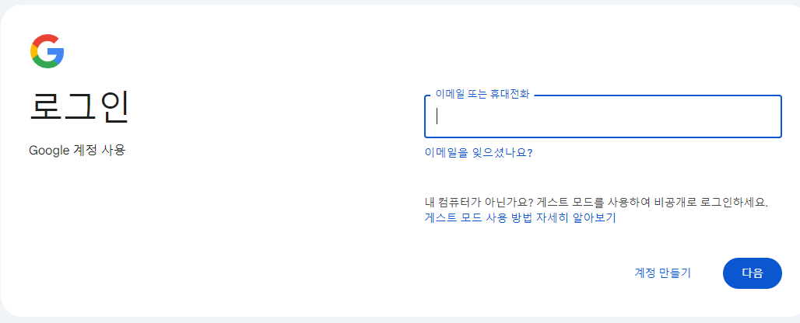
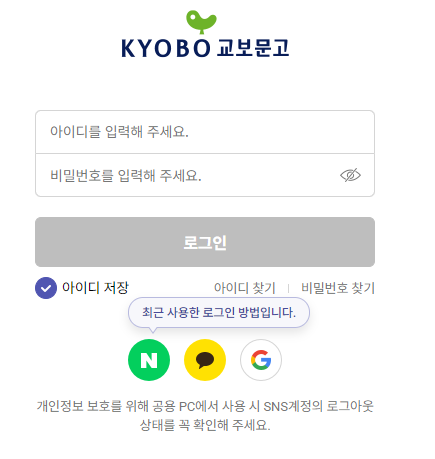

# 로그인 프로세스

단 한 번도 로그인하지 않는 사용자가 구글에 로그인을 한다고 하자. 보통 다음의 순서를 따를 것이다

> 1. 미리 회원가입한 아이디 정보를 통해 로그인 시도
> 2. 해당 아이디를 입력한 사람이, 정말 자신인지 알기 위한 2차 인증(사용자 설정 시)
>     - 보통 휴대폰의 애플리케이션에 인증 코드를 보내 확인하는 방식으로 진행된다.
> 3. 로그인 성공

또한, 일부 사이트에서는 해당 사이트의 번거로운 회원가입 과정 없이도 카카오톡, 네이버, 구글 로그인 등, 대형 IT 기업의 아이디를 통해 로그인할 수도 있다. 순서는 다음과 같다.

> 1. 네이버 로그인 버튼 클릭
> 2. 네이버에서 제공하는 로그인 페이지로 이동
>    - 만약, 이미 네이버에 로그인이 되어 있다면 이 과정을 거치지 않는다. (사실 거치는 것이지만, 적어도 클라이언트에겐 그렇게 보인다.)
> 3. 로그인 성공

우리는 단 한 번의 로그인으로 한 웹사이트의 자원에 지속적으로 접근할 수 있는 권한을 얻는다. 하지만 다음과 같은 경우도 있다.

- 어떤 사이트는 한 번만 로그인 하면 로그아웃 하지 않는 이상 그 상태가 계속 지속된다. 하지만 그렇지 않는 경우도 있다.
- 금융 기관이나 공공 기관과 같은 사이트는 로그인 뒤, 10분 ~ 15분 정도 웹사이트 내에서 활동하지 않으면 자동으로 로그아웃된다.
- 한 도메인의 홈페이지에서 로그인하면, 해당 도메인의 하위 도메인에서도 로그인 상태가 유지된다.
  - 예를 들어, 네이버 홈페이지에서 로그인을 하면 네이버 카페, 네이버 뉴스 등의 하위 도메인에서도 로그인이 유지된다.

이 글에서 위의 현상을 모두 설명할 수는 없지만, 이러한 기능을 구현하기 위해서는 반드시 Cookie와 Session, JWT에 대해 이해해야한다

## 로그인 정보의 저장

로그인 방식을 구현하기 위해서는 반드시 필수적으로 거쳐야하는 질문이 있다.

> 로그인 정보를 어디에 저장해야할 것인가.

