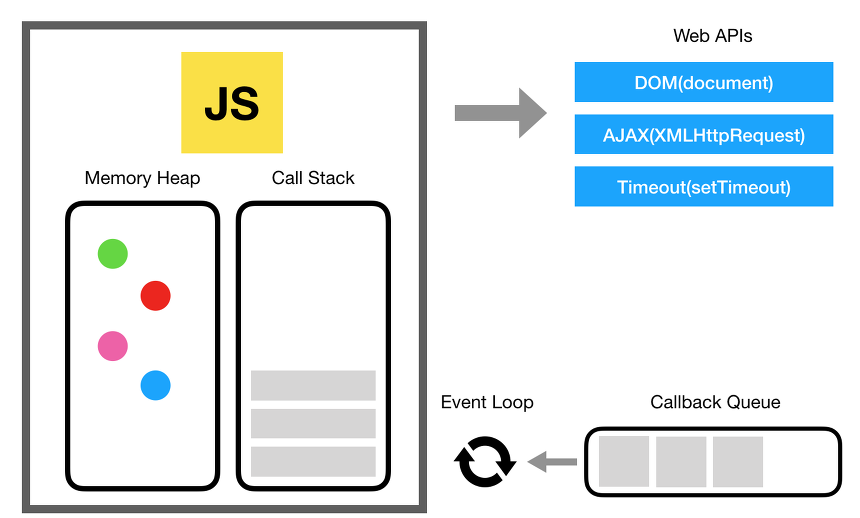

Javascript는 기본적으로 싱글 스레드(Single Threaded) 구조로써, 한 번의 요청을 수행하는 동안, 다른 요청을 처리할 수 없다. 하지만 우리는 비동기 함수를 사용하면서 마치 동시에 여러 스레드가 수행되는 것처럼 병렬 로직을 작성하기도 했다.(`Promise.all`)

결론부터 말하자면, 자바스크립트 자체만으로는 병렬 처리를 할 수 없다. **비동기 함수 또한 사실, 직렬로 처리된다. 단지 적절한 시간에 지연되어 실행될 뿐이다.**

비동기 함수가 어떻게 처리 되는지는 자바스크립트 런타임 환경의 이벤트 루프의 작동 원리를 통해 이해할 수 있다.

# 자바스크립트의 실행 구조와 런타임 모델의 작동 원리



위의 그림을 보면 다음을 알 수 있다.

- Javascript 엔진 자체만으로는 크게 메모리 힙과 콜 스택의 자료 구조를 가지고 있다.
- Javascript를 실행하는 런타임 모델은 콜백 큐라는 자료구조를 가지고, 이벤트 루프를 통해 제어되고 있다.
- 위의 그림에서 Web APIs는 클라이언트 사이드 Web APIs(DOM, AJAX ...)로 브라우저에서 자바스크립트가 호출할 수 있는 대부분의 비동기 함수를 포함한다.

> 위의 그림을 브라우저 환경이 아닌 Node.js 환경으로 대체한다면, Web APIs 대신 비동기적으로 동작하는 Node.js 내장 모듈로 대체할 수 있다,(fs, dns...)

자바스크립트가 실행될 수 있는, 자바스크립트 엔진부터 살펴보자.

## 함수는 콜스택의 최상단에 올라야 비로소 실행된다.

다음과 같은 자바스크립트 로직이 있다고 해보자.

```js
function A() {
  B()
  return 0
}
A()
```

해당 함수가 실행되는 순서를 메모리 구조 관점에서 보면 다음과 같다.

> 1. `A` 함수가 실행될 때, `Frame`의 단위로 콜 스택에 올라간다. `Frame`은 해당 함수가 호출될 때의 파라미터, 함수 내부의 지역변수를 포함하여 생성된다. 이를 `FrameA` 라고 하자.
> 2. 함수 내부에 또 다른 함수`B`가 있다면, 콜스택에 쌓여있던 `FrameA` 위에 해당 함수의 프레임인 `FrameB`가 쌓인다.
> 3. `B`가 수행을 완료하면, `FrameB`는 콜 스택의 밖으로 꺼내지게 된다.
> 4. 이후 다시, `FrameA`가 최상단에서 실행되면서, 최종적으로 `0`을 반환하게 된다.

하지만, 이것만으론 비동기 함수를 설명할 수 없다. 만약 **한 함수가 콜 스택의 최상단을 차지하는 시간이 너무 길다면, 싱글 스레드인 자바스크립트로써는 다른 모든 작업을 멈춰야만 한다**.

이러한 자바스크립트의 한계를 런타임(브라우저, Node.js) 차원에서 도와주는 방법이, **콜백 큐와 이벤트 루프**이다.

## 콜백 큐는 콜백 함수(비동기 함수)가 콜스택에 올라가기 전에 대기하는 장소이다.

상대적으로 처리 시간이 오래 걸리는 I/O 작업이나, `setTimeout`와 같은 비동기 함수를 호출했을 때, 해당 함수가 적절한 시간에 실행될 수 있도록 대기하는 콜백 큐에 들어가게 된다.

```js
function A() {
  setTimeout(() => console.log("콜백 큐에 들어갈 콜백 함수"), 1000)
}
A()
```

콜백 함수가 콜백 큐에 들어갈 때, `Message`라는 콜백 함수를 처리하는 객체의 형태로 큐에 들어가게 된다. **이벤트 루프는 콜백 큐와 콜 스택을 감시하며, 콜 스택이 비었을 때, 가장 오래된 메시지를 큐에서 꺼내 메세지와 연결된 함수를 호출하여 콜 스택 프레임을 생성**한다.

각 메세지는 다른 메세지에 영향을 주지 않으며, 반드시 한 메시지가 끝나야 다음 메시지가 실행된다(Run-to-Completion)

# 자바스크립트 직렬 처리의 성능을 끌어올리는 방법

위의 사실로, 자바스크립트 자체만으론 비동기 함수, 동기 함수 모두 지연 시간의 차이일 뿐, 결국 하나의 콜스택에서 직렬 방식으로 처리된다는 것을 알 수 있다.

결국, 자바스크립트 엔진 하나로 모든 것을 감당하기에는 성능 문제가 너무 크다는 것이다.

하지만, 자바스크립트의 실행은 자바스크립트가 실행되는 런타임 환경을 빼놓고 이야기할 수 없다. 그만큼 런타임 측에서 자바스크립트를 보조하는 것이 많다.

## C, C++, Rust와 같은 로우 레벨 API를 활용한 성능 향상

> 이하 글의 `외부 시스템`은 자바스크립트로 실행되는 환경이 아닌 다른 멀티 쓰레드를 지원하는 언어로 만들어진 환경을 뜻한다. 실제로 브라우저의 Web APIs는 C++, Rust로 이루어진 기능을 자바스크립트로 호출할 수 있게 추상화해둔 것이다. - [MDN Web APIS](https://developer.mozilla.org/en-US/docs/Learn/JavaScript/Client-side_web_APIs/Introduction)

자바스크립트의 한계, 즉 싱글 스레드만으로는 해결할 수 없는 것들은 예를 들어 다음과 같다.

- 클라이언트 사이드(브라우저)의 Web APIs
  - DOM Control
  - AJAX
  - Timer(`setTimeout`... )
  - ...
- 서버 사이드(Node.js)의 libuv에서 지원하는 비동기 기능
  - 파일 시스템 접근 모듈(fs)
  - DNS 제어 모듈
  - ...

자바스크립트는 언어의 한계로 할 수 없는 기능을 C, C++와 같은 로우 레벨로 구현된 API를 호출하므로써 기능을 수행할 수 있게 된다.
이는 로우 레벨 언어의 성능과 기능을 그대로 사용할 수 있음을 뜻하며 이 덕분에 자바스크립트의 런타임의 성능 또한 크게 상승했다.

## 쉬지않고 콜스택에 함수를 올리는 이벤트 루프와 Promise로 명령 순서 제어하기

위에서 `setTimeout`을 사용하는 함수를 다시 한 번 살펴보자.

```js
function A() {
  setTimeout(() => console.log("콜백 큐에 들어갈 콜백 함수"), 1000)
}
A()
```

함수가 실행되면 콜스택에 해당 함수가 프레임 단위로 올라가고, 함수가 실행을 끝마칠 때까지, 콜스택의 최상단을 차지하고 있다고 말했다.

자바스크립트에서 외부 API를 사용할 때도 이러한 원리는 마찬가지이지만, 단 하나가 달라진다.

> 1. `A` 함수가 실행되면서, `FrameA`가 콜스택 최상단에 올라간다.
> 2. **Web APIs의 Timer 기능에 속한 `setTimeout`을 만나면 외부 API의 해당 기능을 호출하며, 콜스택에 해당 함수 프레임을 생성하자마자 바로 콜스택에서 지워버린다.**
> 3. `A` 함수는 그대로 실행을 종료한다.
> 4. 백그라운드에서 `setTimeout` 함수로 인해 1초간 대기 한 후, 콜백 큐에 해당 결과를 `Message`로 추가한다.
> 5. `A` 함수가 실행을 종료하여, 콜스택이 빈 상태이므로, 이를 감시하던 이벤트 루프가 외부 API의 결과를 콜백 큐에서 콜 스택으로 올린다.
> 6. 콜백 함수(`console.log`)가 실행된다.

여기서 중요한 점은, 결국 콜스택에 비어있을 때, 콜백 함수가 실행되는 것이므로, 만약 콜스택이 비어있지 않다면, 더 많은 시간을 소요하게 된다. 즉 완벽하게 1초를 대기하는 것이 아니라, 시간은 언제든지 달라질 수 있다.

이러한 현상은 Node.js를 사용할 때 흔하게 볼 수 있다. 이벤트 루프의 원리를 이해하지 못하면, 다음과 같은 코드를 작성했을 때, 원하는 결과가 나오지 않는 것을 볼 수 있다.

```js
const FindAllUser = () => {
  const find_users = `SELECT * FROM users`

  const users = DBClient(find_users) // 외부 API를 호출했으나, 결과의 반환을 기다리지 않고 다음 줄이 바로 실행됨.

  console.log(users) // result: undefined
}
```

즉, 자바스크립트 내부에서 결과값 호출의 순서를 보장하는 기능이 필요해졌다. 한 비동기 함수의 결과값이 오지 않았다면, 다음 함수를 실행하고 싶지 않을 때 `Promise`를 사용하는 것이다.

```js
const FindAllUser = async () => {
  const find_users = `SELECT * FROM users`

  const users = await DBClient(find_users) // Promise가 결과값을 이행(Fulfilled) 혹은 거절(Rejected) 될 때까지, 다음 명령줄을 실행하지 않고, 다른 작업을 수행함.

  console.log(users)
}
```

> 여기서 다른 작업이란, **마이크로 테스크 큐**와 **매크로 테스크 큐**의 개념을 알고 있어야 이해할 수 있다. 이 주제는 현재 글의 주제에서 벗어나므로 `Promise`가 결과 값을 반환할 때까지 해당 함수를 일시 중지 하고, 마이크로 테스크 큐에 들어가며, 런타임은 마이크로, 매크로 테스크 큐에 있는 다른 작업을 시행한다라고 이해하고 넘어가도록 하자.

이러한 방식으로 외부 API 요청을 통해 자바스크립트로 할 수 없는 기능의 결과만을 이벤트 루프를 통해 제어하고, 비동기 함수가 외부에서 실행되는 동안, 다른 작업을 수행할 수 있게 된다. 이러한 방식을 **Non-Blocking I/O**라고 한다.

# 정리

다음의 3가지만 기억하자.

- 자바스크립트는 메인 스레드(이벤트 루프) 하나로만 구성되어 있으나, 외부 API는 멀티 스레드 환경에서 실행되므로, 사실상 멀티 스레드 기능을 한다고 볼 수 있다.
- 이벤트 루프를 통해 외부 API의 결과를 제어하며, 그 결과는 콜스택이 비어있을 때 실행이 된다. 즉 실행 시간이 반드시 보장되지 않는다.
- `Promise`를 통해 API 결과에 대한 순서를 제어할 수 있으며, `Promise` 결과가 반환될 때까지 다른 작업을 수행할 수 있으므로 성능을 크게 끌어올릴 수 있었다.(Non-Blocking I/O)

# 참고글

- [MDN - Event Loop](https://developer.mozilla.org/ko/docs/Web/JavaScript/Event_loop)
- [Blocking/Non-Blocking, Sync/Async](https://joooing.tistory.com/entry/%EB%8F%99%EA%B8%B0%EB%B9%84%EB%8F%99%EA%B8%B0-%EB%B8%94%EB%A1%9C%ED%82%B9%EB%85%BC%EB%B8%94%EB%A1%9C%ED%82%B9)
- [NodeJS 는 Single Thread 일까? Multi Thread 일까?](https://haeunyah.tistory.com/81)
